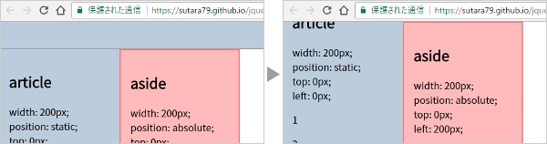

# jquery.simple-scroll-follow

[](https://www.npmjs.com/package/jquery.simple-scroll-follow)
[](https://travis-ci.org/sutara79/jquery.simple-scroll-follow)

jQuery plugin to move the element according to the scrolling window.




## Demo
https://sutara79.github.io/jquery.simple-scroll-follow/


## Install
- [GitHub](https://github.com/sutara79/jquery.simple-scroll-follow): Clone or download.
- [npm](https://www.npmjs.com/package/jquery.simple-scroll-follow): `npm i jquery.simple-scroll-follow`
- CDN ([jsDelivr](https://github.com/jsdelivr/jsdelivr#usage)):
    - jquery.simple-scroll-follow.min.js: [v3.1.2](https://cdn.jsdelivr.net/npm/jquery.simple-scroll-follow@3.1.2/dist/jquery.simple-scroll-follow.min.js)


## Usage
###### HTML
```html
<div id="foo">Element to follow</div>

<script src="https://code.jquery.com/jquery-3.3.1.min.js"></script>
<script src="jquery.simple-scroll-follow.min.js"></script>
```

###### CSS
```css
body {
  background: url(null) fixed; /* for Google Chrome */
}

#foo {
  position: absolute;
}
```

###### JavaScript
```javascript
$('#foo').simpleScrollFollow();
```


## Option
|name|type|default|description|
|--|--|--|--|
|[limit_elem](http://sutara79.github.io/jquery.simple-scroll-follow/#limit_elem)|Object, string|`$('body')`|An element that indicates lower limit to scroll|
|[min_width](http://sutara79.github.io/jquery.simple-scroll-follow/#min_width)|number|`0`|Minimum window width to enable this plugin|
|[enabled](http://sutara79.github.io/jquery.simple-scroll-follow/#enabled)|boolean|`true`|Enable scroll or not|
|[upper_side](http://sutara79.github.io/jquery.simple-scroll-follow/#fixed-elem)|string|`null`|An fixed element that indicates upper limit to scroll|
|[lower_side](http://sutara79.github.io/jquery.simple-scroll-follow/#fixed-elem)|string|`null`|An fixed element that indicates lower limit to scroll|


## Public Method
(since v3.0.0)

For the details, see [documentation](http://localhost/gh-pages/jq-plugin/jquery.simple-scroll-follow/#public-method).

### .setEnabled()
##### Parameter

|No.|type|default|description|
|--|--|--|--|
|1|boolean|`true`|`true`: this plugin resumes.<br>`false`: this plugin stops.|


## License
[MIT](https://www.opensource.org/licenses/mit-license.php)


## Author
[Yuusaku Miyazaki](http://sutara79.hatenablog.com/entry/2014/06/21/185709)
( <toumin.m7@gmail.com> )
